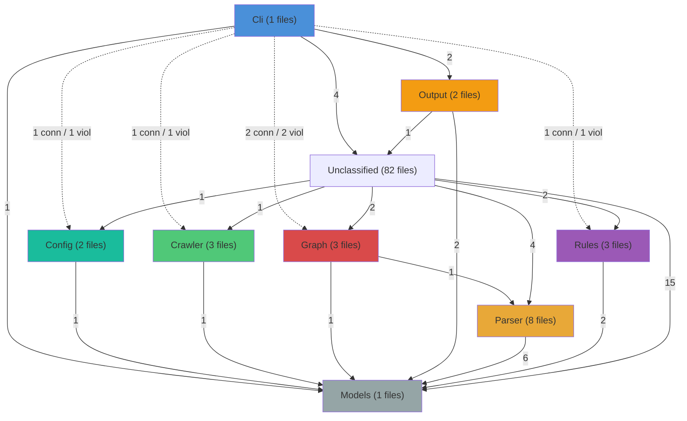

```mermaid
graph TD
    cli["Cli (1 files)"]
    output["Output (2 files)"]
    rules["Rules (3 files)"]
    layer_graph["Graph (3 files)"]
    parser["Parser (8 files)"]
    crawler["Crawler (3 files)"]
    config["Config (2 files)"]
    models["Models (1 files)"]
    unclassified["Unclassified (82 files)"]
    cli -.->|1 conn / 1 viol| config
    cli -.->|1 conn / 1 viol| crawler
    cli -.->|2 conn / 2 viol| layer_graph
    cli -->|1| models
    cli -->|2| output
    cli -.->|1 conn / 1 viol| rules
    cli -->|4| unclassified
    config -->|1| models
    crawler -->|1| models
    layer_graph -->|1| models
    layer_graph -->|1| parser
    output -->|2| models
    output -->|1| unclassified
    parser -->|6| models
    rules -->|2| models
    unclassified -->|1| config
    unclassified -->|1| crawler
    unclassified -->|2| layer_graph
    unclassified -->|15| models
    unclassified -->|4| parser
    unclassified -->|2| rules

    %% Styles
    style cli fill:#4A90D9
    style output fill:#F39C12
    style rules fill:#9B59B6
    style layer_graph fill:#D94A4A
    style parser fill:#E8A838
    style crawler fill:#50C878
    style config fill:#1ABC9C
    style models fill:#95A5A6
```
