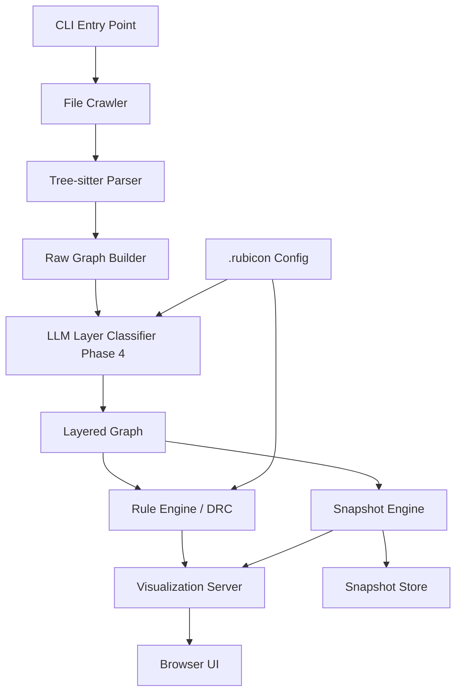
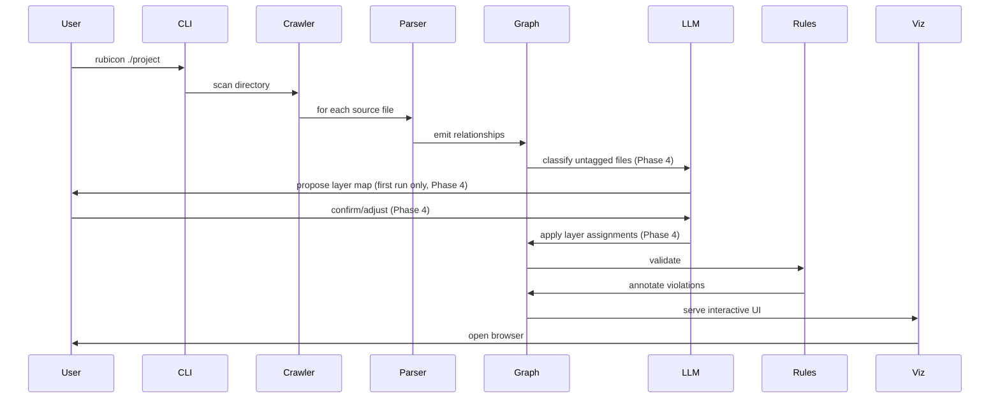

# Rubicon — Architecture Document

## Problem Statement

When using agentic code generation tools, developers need a way to visualize and validate the structural integrity of a codebase — especially in languages they may not be fluent in. Existing tools either require deep language knowledge, operate only at the individual symbol level, or don't support custom architectural layer definitions.

Rubicon crawls a repository, classifies files into architectural layers, builds a dependency/inheritance/ownership graph, checks it against design rules, and renders an interactive block diagram with drill-down capability.

---

## System Architecture



---

## Components

### 1. CLI Entry Point

The user-facing interface. All interaction starts here.

```
rubicon ./my-project              # first run — crawl, classify, visualize
rubicon ./my-project --diff       # compare against last snapshot
rubicon ./my-project --reconfig   # re-run layer classification
rubicon ./my-project --export svg # export static diagram
```

**Technology:** Python (Click or Typer for CLI framework)

---

### 2. File Crawler

Walks the repo and inventories every source file, respecting `.gitignore` and a configurable exclude list.

**Input:** Root directory path
**Output:** List of `SourceFile` objects with path, language (detected via extension + heuristics), and raw content

```
SourceFile {
    path: string
    language: string        # "kotlin", "swift", "typescript", etc.
    content: string
    hash: string            # for change detection on subsequent runs
}
```

**Key decisions:**
- Language detection via file extension mapping (covers 95% of cases)
- Skips binary files, generated code directories (build/, node_modules/, .gradle/, Pods/)
- Configurable via `.rubicon` ignore patterns

---

### 3. Tree-sitter Parser

The core extraction engine. Parses each file and extracts three types of relationships.

**Input:** `SourceFile`
**Output:** List of `Relationship` edges

```
Relationship {
    source: string          # fully qualified symbol or file path
    target: string          # what it depends on
    type: enum {
        IMPORT,             # file/module imports
        INHERITANCE,        # class extends / implements
        OWNERSHIP,          # property declaration holding a reference
        FUNCTION_CALL       # direct invocation (optional, Phase 2)
    }
    source_file: string
    line_number: int
}
```

**How each relationship type is extracted:**

| Type | What Tree-sitter looks for |
|------|---------------------------|
| IMPORT | `import_statement`, `include_directive`, `require_call` nodes |
| INHERITANCE | `class_declaration` → `superclass`, `protocol_conformance`, `implements_clause` |
| OWNERSHIP | Property/field declarations where the type is a project-internal class |
| FUNCTION_CALL | Call expressions where the callee resolves to a project-internal symbol |

**Language support strategy:**
- Tree-sitter grammars exist for 100+ languages
- Phase 1 starts with: TypeScript, Python, Kotlin
- Phase 4 expands to: Swift, Go, Rust, Java, C#, C/C++
- Each language needs a small adapter (~50-100 lines) that maps Tree-sitter node types to the generic relationship model
- Unknown languages fall back to regex-based import parsing (Phase 4) — this captures imports only, not inheritance or ownership

---

### 4. Raw Graph Builder

Assembles all relationships into an in-memory directed graph.

```
Node {
    id: string              # file path or fully qualified class name
    file_path: string
    symbols: string[]       # classes/structs/protocols defined in this file
    language: string
}

Edge {
    source: Node
    target: Node
    relationships: Relationship[]   # multiple relationships can exist between two nodes
}
```

**Technology:** NetworkX (Python) — mature graph library with built-in cycle detection, pathfinding, and community detection algorithms.

---

### 5. LLM Layer Classifier *(Phase 4)*

Assigns each file/module to an architectural layer.

**First run workflow:**
1. Sample representative files from each directory (up to 3 per directory)
2. Send to LLM provider with a classification prompt (provider is abstracted behind a protocol interface; Claude is the default):

```
Given this file from a software project, classify it into one of these
architectural layers: presentation, domain, data, networking, navigation,
dependency_injection, configuration, testing, utilities.

If none fit, propose a new layer name.

File: {path}
Content (first 200 lines): {content}
```

3. Aggregate results — if most files in a directory get the same classification, apply it to the whole directory
4. Present the proposed layer map to the user for review
5. Save to `.rubicon` config

**Subsequent runs:**
- Load saved config
- Only reclassify new/changed files (detected via content hash)
- Flag files whose classification confidence is low

**Config format (.rubicon):**

```yaml
layers:
  presentation:
    directories:
      - app/ui/
      - app/screens/
    color: "#4A90D9"

  domain:
    directories:
      - app/models/
      - app/usecases/
    color: "#50C878"

  data:
    directories:
      - app/database/
      - app/repository/
    color: "#E8A838"

  networking:
    directories:
      - app/api/
      - app/network/
    color: "#D94A4A"

rules:
  - no_upward_dependency
  - no_layer_skipping
  - inheritance_flows_downward
  - no_circular_ownership

layer_order:     # defines "up" and "down" for directional rules
  - presentation
  - domain
  - data
  - networking
```

---

### 6. Rule Engine (DRC)

Checks the layered graph against architectural rules. Each rule is a function that takes the graph and returns a list of violations.

```
Violation {
    rule: string
    severity: enum { ERROR, WARNING, INFO }
    source_node: Node
    target_node: Node
    relationship: Relationship
    message: string
}
```

**Built-in rules:**

| Rule | Logic | Severity |
|------|-------|----------|
| `inheritance_flows_downward` | If A inherits from B, A's layer must be same or below B's layer | ERROR |
| `no_circular_ownership` | Detect cycles in ownership edges using DFS cycle detection | ERROR |
| `no_upward_dependency` | Imports should not go from lower layers to higher layers | WARNING |
| `no_layer_skipping` | Presentation should not directly reference data (must go through domain) | WARNING |
| `single_responsibility` | Flag files with edges to 4+ different layers | INFO |
| `orphan_detection` | Flag files with zero incoming or outgoing edges | INFO |

**Custom rules** can be added via the config:

```yaml
custom_rules:
  - name: "viewmodels_only_in_presentation"
    pattern: "files matching *ViewModel* must be in presentation layer"
  - name: "no_database_in_domain"
    pattern: "domain layer files must not import from database packages"
```

---

### 7. Snapshot Engine

Persists the graph state for diff comparison.

**On each run:**
1. Serialize the current layered graph + violations to a timestamped JSON file
2. Store in `.rubicon/snapshots/`

**Diff mode:**
1. Load previous snapshot
2. Compare edge-by-edge:
   - **Added edges** (green): new dependencies introduced
   - **Removed edges** (red/gray): dependencies that were removed
   - **New violations** (red flash): rules that weren't violated before but are now
   - **Resolved violations** (green flash): rules that were violated but are now fixed
3. Pass diff data to visualization

```
Snapshot {
    timestamp: datetime
    commit_hash: string?        # if in a git repo
    nodes: Node[]
    edges: Edge[]
    violations: Violation[]
    layer_map: map<string, string>
}
```

---

### 8. Visualization Server

Serves an interactive browser UI on localhost.

**Technology:** FastAPI (Python) serving a single-page app with D3.js

**Three view levels:**

#### Level 1 — Layer Block Diagram (default view)
```
┌─────────────┐         ┌──────────────┐
│ Presentation │───47───▶│    Domain     │
│   (12 files) │         │  (8 files)   │
└──────┬───────┘         └──────┬───────┘
       │                        │
       │ ⚠ 3                    │ 22
       ▼                        ▼
┌─────────────┐         ┌──────────────┐
│    Data      │◀──15───│  Networking   │
│  (10 files)  │        │  (6 files)   │
└──────────────┘         └──────────────┘
```

- Blocks sized proportionally to file count
- Edge thickness proportional to connection count
- Edge color: green = normal, yellow = warning, red = violation
- Click an edge to drill down
- Click a block to see all files in that layer

#### Level 2 — File-Level View (within or between layers)
```
        ┌──────────────┐
        │ UserScreen.kt │
        └──┬───┬───┬───┘
           │   │   │
    ┌──────┘   │   └──────┐
    ▼          ▼          ▼
┌────────┐ ┌────────┐ ┌──────────┐
│UserVM  │ │NavRoute│ │DBHelper  │
└────────┘ └────────┘ └──────────┘
                         ⚠ VIOLATION
                         Layer skip:
                         presentation → data
```

- Shows individual files as nodes
- Edges labeled with relationship type (import, inheritance, ownership)
- Violations highlighted with icon + explanation

#### Level 3 — Ratsnest View (single file focus)
```
                ┌──────────┐
     ┌─────────▶│ BaseRepo │ (inherits)
     │          └──────────┘
     │
┌────┴────┐     ┌──────────┐
│ UserRepo│────▶│ ApiClient│ (owns)
└────┬────┘     └──────────┘
     │
     │          ┌──────────┐
     └─────────▶│ UserModel│ (imports)
                └──────────┘
```

- Click any file from Level 2 to enter this view
- Shows ALL connections for one file — inbound and outbound
- Color-coded by relationship type:
  - Blue = import
  - Orange = inheritance
  - Purple = ownership
- Violation edges pulsate red
- Click any connected node to recenter the ratsnest on it

---

### 9. Diff Overlay (on any view level)

When running with `--diff`, all three view levels gain a diff overlay:

- **New connections** = green dashed lines
- **Removed connections** = faded gray lines
- **New violations** = red pulsing badge with count
- **Resolved violations** = green checkmark badge
- Summary banner at top: "Since last snapshot: +12 connections, -3 connections, 2 new violations"

---

## Data Flow



---

## Technology Stack

| Component | Technology | Rationale |
|-----------|-----------|-----------|
| CLI | Python + Typer | Fast to build, good ecosystem |
| File parsing | Tree-sitter (via py-tree-sitter) | Language-agnostic AST parsing |
| Graph model | NetworkX | Cycle detection, pathfinding built-in |
| LLM classification *(Phase 4)* | Abstracted provider interface; Claude API default | Cost-effective for classification tasks |
| Web server | FastAPI | Lightweight, async, serves static + API |
| Visualization | D3.js (force-directed + custom layouts) | Gold standard for interactive graphs |
| Snapshot storage | JSON files in .rubicon/snapshots/ | Simple, diffable, no database needed |
| Config | YAML (.rubicon file) | Human-readable, easy to hand-edit |

---

## Development Phases

### Phase 1 — Core Engine (1.5-2 weeks)
- CLI scaffolding with Typer
- File crawler with language detection and .gitignore support
- Tree-sitter integration with adapters for 2-3 initial languages (TypeScript, Python, Kotlin)
- Full relationship extraction from day one: imports, inheritance, and ownership
- Manual layer tagging via `.rubicon` config file
- Full rule engine with all 6 built-in rules (inheritance direction, circular ownership, upward dependencies, layer skipping, single responsibility, orphan detection)
- Violation reporting in terminal output (structured, color-coded)
- Static Mermaid diagram output for layer view

**Deliverable:** Run `rubicon ./project`, get a Mermaid layer diagram with all architectural violations flagged — including inheritance direction and circular ownership checks. The hard problem (parsing real relationships) is solved here.

### Phase 2 — Interactive Visualization + Diff (1.5-2 weeks)
- FastAPI server serving D3.js single-page app
- Three-level drill-down (layer blocks → file-level → ratsnest)
- Color-coded relationship types (blue = import, orange = inheritance, purple = ownership)
- Violation highlighting with pulsing red indicators and click-to-explain
- Snapshot engine: save graph state on each run
- Diff mode: compare against previous snapshot, overlay added/removed connections and new/resolved violations

**Deliverable:** Full interactive browser UI with PCB-style exploration and the ability to see what changed between agent runs.

### Phase 3 — Language Expansion + Polish (ongoing)
- Additional Tree-sitter adapters: Swift, Go, Rust, Java, C#, C/C++
- Regex fallback parser for languages without a Tree-sitter adapter
- Custom rule definitions via config (pattern-based rules like "ViewModels must live in presentation layer")
- Export options: SVG, PNG, PDF for sharing architecture diagrams
- CI integration: run `rubicon --check` in a pipeline, fail on new violations

**Deliverable:** Broad language support, CI-ready, and a polished daily-driver tool.

### Phase 4 — LLM Intelligence (1 week)
- Abstract LLM provider interface (protocol class) with Claude as the default implementation, swappable for OpenAI, Ollama, etc.
- LLM-based layer auto-classification via configurable provider
- Incremental reclassification: only re-classify new or changed files on subsequent runs
- Interactive first-run flow: LLM proposes layer map, user confirms/adjusts, config is saved
- Natural language violation explanations (click a violation, get a plain-English description of why it's a problem)
- Optional: "explain this architecture" one-paragraph summary generation

**Deliverable:** Zero-config first run — point at any repo, get a fully classified architecture map without hand-writing a config file.

---

## File Structure

```
rubicon/
├── cli.py                  # entry point, argument parsing
├── crawler/
│   ├── scanner.py          # file discovery, language detection
│   └── ignore.py           # .gitignore + custom ignore handling
├── parser/
│   ├── base.py             # abstract parser interface
│   ├── treesitter.py       # tree-sitter based extraction
│   ├── regex_fallback.py   # regex import parsing for unsupported languages
│   └── adapters/           # per-language tree-sitter query adapters
│       ├── typescript.py
│       ├── python.py
│       ├── kotlin.py
│       ├── swift.py
│       └── ...
├── graph/
│   ├── models.py           # Node, Edge, Relationship dataclasses
│   ├── builder.py          # assembles raw graph from parser output
│   └── layered.py          # applies layer classifications to graph
├── classifier/
│   ├── provider.py         # LLM provider protocol interface (Phase 4)
│   ├── anthropic.py        # Claude/Anthropic provider implementation (Phase 4)
│   ├── llm.py              # LLM classification orchestration (Phase 4)
│   ├── heuristic.py        # rule-based fallback classification
│   └── config.py           # .rubicon read/write
├── rules/
│   ├── engine.py           # runs all rules, collects violations
│   ├── builtin.py          # 6 built-in rules
│   └── custom.py           # user-defined rule parsing
├── snapshot/
│   ├── store.py            # save/load snapshots
│   └── diff.py             # compare two snapshots
├── viz/
│   ├── server.py           # FastAPI app
│   ├── api.py              # JSON endpoints for graph data
│   └── static/
│       ├── index.html
│       ├── app.js          # D3.js visualization
│       └── styles.css
├── .rubicon                # project config (generated)
└── pyproject.toml
```
